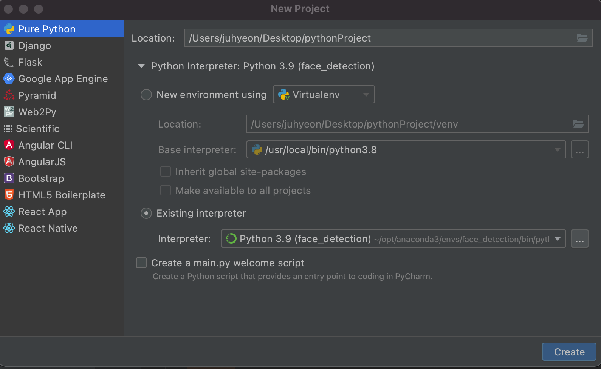
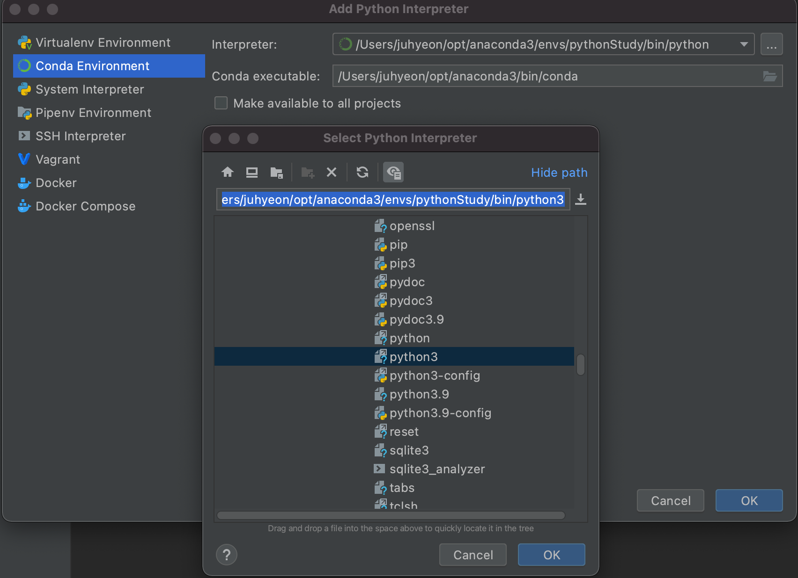

Python Install Guide
================
###  Pycharm IDE

IDE로 Pycharm Community/Professional 을 사용할 예정입니다. 학교 계정으로 인증을 받으면 Professional 버전을 사용할 수 있고, 가장 주된 차이점은 .ipynb 파일을 IDE 안에서 수정 및 블럭 단위 실행을 할 수 있는 것입니다.

https://www.jetbrains.com/ko-kr/pycharm/download/#section=mac

### Python with Anaconda

실제로 코드 실행에 필요한 인터프리터인 Python을 설치해야 합니다. 공식 사이트에서 제공하는 Python을 다운받아도 되지만, Library Version Control의 용이함을 위해 Anaconda를 통한 가상 Environment를 만들어서 사용할 예정입니다.

Anaconda 설치는 아래 링크를 통해 할 수 있습니다.

https://www.anaconda.com/products/individual#download-section

Windows 환경에서 설치를 하면 Anaconda Prompt를 이용하여 Anaconda에서 제공하는 각종 명령어를 사용할 수 있으나, Mac에서는 이 프로그램이 설치되지 않습니다. 그러므로 환경 변수에 Anaconda 설치 경로를 추가해줘야 터미널에서 명령어가 사용가능합니다.

사용하는 터미널 종류에 따라 bashrc, zshrc 파일에 Anaconda 설치 경로를 추가해주시면 됩니다.

Vim Editor를 활용하여 bashrc 파일을 열어줍니다.

    vi ~/.bashrc

bashrc 파일 안에 다음 행을 추가해줍니다.

    export PATH="/home/usr/anaconda3/bin:$PATH"

다음 코드로 수정사항을 반영해줍니다.

    source ~/.bashrc

Anaconda Prompt / Terminal 에서 다음 코드가 정상적으로 작동한다면 설치가 완료된 것 입니다.

    conda list

### Create Environment with Anaconda

다음 명령어로 가상환경을 만들 수 있습니다.

    conda create -n env_name
    
그리고 가상환경은 다음 코드를 통해 실행시킬 수 있습니다.

    conda activate env_name
        
가상환경을 실행시킨 후, Python을 설치해줍니다.

    conda install python

### Create Project in Pycharm with Virtual Environment

Existing Interpreter에 있는 점 세개 버튼을 누릅니다.

Conda Environment => 점 세개 버튼을 누르고 위에서 만든 가상환경의 Python 경로를 선택해줍니다.

위에서 저는 `pythonStudy` 이름으로 가상환경을 만들었고, Mac/Linux 기준 Default 경로는 다음과 같습니다.

    /usr/username/opt/anaconda3/envs/pythonStudy/bin/python3
        
이를 설정해주면 이제부터 실행하는 모든 코드들은 `pythonStudy` 가상환경에 설치되어 있는 라이브러리에 따라 실행이 됩니다.
